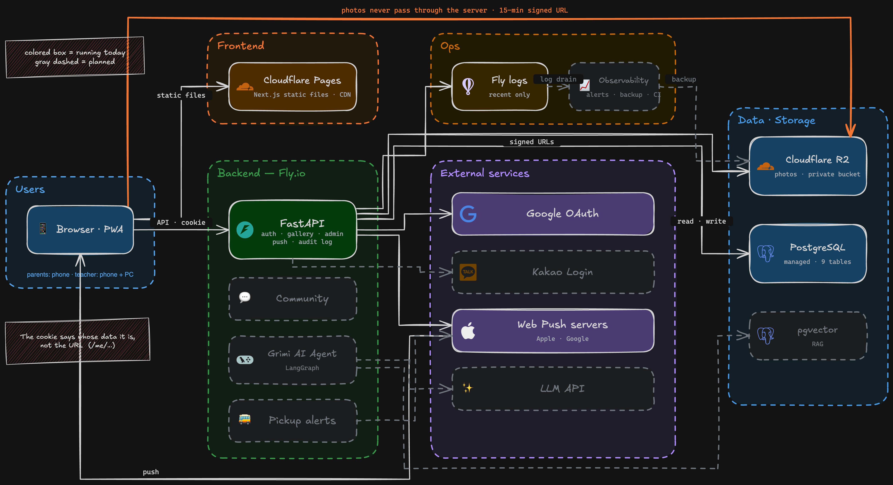

# Grimsup — a production system I own end to end, with real users

**[grimsup.com](https://grimsup.com)** · live since 2026-08-29 · in production with real users

> **The code is private** — it handles real users' photos. This repository is the system's design, operations, and incident record.

> 🇰🇷 한국어: [README.ko.md](./README.ko.md)

Grimsup is the **operations system for one offline children's art school.** Before this, the school
ran on **scattered tools**: photos went out through a messenger app, notices through another app,
questions by phone. None of it belonged to the school. This project pulls that into **one system the
school owns.**

Live today: Google login with teacher approval · a per-child gallery · phone push notifications · an
admin screen · a public page that search engines can find · audit log and structured logging.
Community and an AI agent come next. **One person owns the whole cycle**: planning, design, code,
deployment, real-user support, and incident response.

> This repo **explains the system. It does not contain the code.**
> It is less about *what* was built and more about **how it runs, why it was built this way, and what
> broke and how it was fixed.**
>
> Common implementations that look the same everywhere are left out. Only **decisions made in this
> project** are written down: where there was an alternative, and why this side won.

---

## What this project is trying to show

**Completeness of the cycle, not scale.** This is a small service for one school. Selling it as
"operations experience at scale" would cost trust. What it does show is **one person owning a small
farm end to end**: from planting seeds to dealing with pests. Scale can be learned at a company.
The feel of owning the whole cycle is harder to teach.

So there is one yardstick. Not *"does this traffic need it?"* but **"is this piece missing from the
production cycle?"** Even with few users, audit logs, incident records, alerts, and backups go in.
Tools that only scale demands (Kubernetes and friends) stay out.

**Success is not measured in users.** A school runs on **trust** with the families who come.
This service handles children's photos. One photo shown to the wrong person ends that trust.
So "is it convenient?" came second to **"can it be shown to the wrong person?"**

📌 **No numbers yet.** Visitor counts are not the point. Once DAU and per-feature usage data have
built up, real values will be added here along with operating metrics (uptime · incident count ·
time to recover · cost).

---

## Features

This is **one web app for both phone and PC**, not an app-store app. Parents mostly use phones:
add it to the home screen and it opens like an app and receives push. The teacher uses both phone and
PC. The screens are designed separately for each, but the code and the deployment are one.

| Feature | What | Who | Status |
|---|---|---|---|
| **Login · onboarding** | Google login → choose parent or visitor → parents wait for teacher approval. Google proves *whose account* this is. The teacher proves *whose parent* this is | anyone | ✅ live · [details](./docs/features/auth.md) |
| **Gallery** | A photo the teacher uploads is visible only to that child's guardians. Per-child album · emoji reactions · read receipts · scroll back to old work | parents ↔ teacher | ✅ live · [details](./docs/features/gallery.md) |
| **Web push** | Install to the home screen and the phone rings when a photo arrives | parents · teacher | ✅ live |
| **Admin** | Approve sign-ups · register students · link guardians · manage accounts | teacher | ✅ live |
| **School page** | Location · classes · photos. Public page with search and link previews · privacy policy | anyone | ✅ live |
| **Community** | Teacher posts notices; kids and parents write posts. Replaces the external app used today | whole school | next |
| **Grimi (AI Agent)** | An agent with **different tools for parents, teacher, and visitors**. From answering questions and handling absence/make-up requests to the teacher's morning briefing and pickup alerts. Not a chatbot wrapped around an API — an agent with permission boundaries, audit, and tracing | whole school | planned |
| **Pickup alerts** | Notify the guardian's phone when a child arrives or leaves. Whether this lives inside Grimi or stands alone will be decided on site | parents | planned |

**Every finished feature gets one document under `docs/features/`**: why it was built that way,
and which decisions are actually wired into the code.

---

## Architecture



<sub>Colored box · solid line = running today. Gray dashed = planned. Sources (.excalidraw) live in [docs/architecture/](./docs/architecture/).</sub>

```
Frontend   Next.js static export → Cloudflare Pages
Backend    FastAPI (Docker) → Fly.io
Storage    PostgreSQL (managed) · Cloudflare R2 (photos)
```

→ Layout · permissions · data model · deployment · why these choices: **[docs/architecture.md](./docs/architecture.md)**

---

## Operations — a record of responses, not of zero incidents

Incidents are treated as harvest, not accidents. Each one is written up in four parts:
**detect → diagnose → recover → what we learned**. Missed causes and wrong guesses stay in the record.
There were two incidents in the first week after launch. Both were found **by chance, not by an alert**.
That is the biggest open gap in this project right now, and it is not hidden.

**What is still missing**: alerting · log retention · our own backups · frontend tests.
Operations here means **knowing what is missing**, not claiming everything is in place.

→ Full incident write-ups and the recording rules: **[docs/incidents.md](./docs/incidents.md)**

---

## What comes next

```
Observability first   Alerts (including request-rate anomalies) · log retention · health checks ·
                      backup and restore drills · frontend tests · SLOs.
                      Two incidents set this order. Before features.

Community             Notices + comments → turn off the external app → kids' posts.
                      A second login provider lands first.

Grimi (AI Agent)      LangGraph · RAG (pgvector) · tool calling. Per-role tools · 7 safeguards.
                      Stabilize with read-only tools first → write tools only after the safeguards stand.

Remote operation      Three months in another country, maintenance only. Observability is the precondition.
```

→ Confirmed vs. direction, kept apart: **[docs/roadmap.md](./docs/roadmap.md)**

---

## Stack

| Area | What |
|---|---|
| Frontend | Next.js (App Router · static export) · TypeScript · Tailwind · PWA + Web Push |
| Backend | FastAPI · SQLAlchemy · Alembic · pytest against real PostgreSQL |
| DB | PostgreSQL (managed) · 9 tables · 13 migrations |
| Infra | Cloudflare Pages + R2 · Fly.io (Docker) · Cloudflare Registrar |
| Auth | Google OAuth · HttpOnly cookie JWT · teacher approval for membership |
| Planned | LangGraph (AI agent) · pgvector (RAG) |

---

## Read more

| Document | What |
|---|---|
| [Architecture](./docs/architecture.md) | How the system fits together and why |
| [Feature docs](./docs/features/) | One document per feature — the decisions wired into the code |
| [Incidents](./docs/incidents.md) | Incident write-ups — grows with every incident |
| [Roadmap](./docs/roadmap.md) | What comes next — confirmed vs. direction |
| ADRs (architecture decision records) | *in preparation* |
| [TIL](https://github.com/vamosbada/TIL) | Learning notes — retrospectives for this project link here |
| Tech blog (Medium) | *in preparation* — design decisions and incidents as posts |

---

<sub>Planning · development · operations: [@vamosbada](https://github.com/vamosbada) ·
The service code is private. It handles real users' photos and conversations, so that repository
stays closed. This repository explains the system.</sub>
