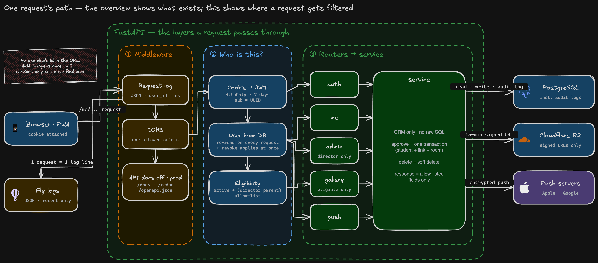

# Architecture — how it runs, and why it was built this way

> For readers who saw the one-picture overview in the [README](../README.md) and want more.
> Order: layout → permissions → data model → why these choices → deployment.
> Decisions inside each feature (the path of one photo · sync · the login flow) live in [features/](./features/).

---

## 1. Layout

> **Solid = built and running. Dashed = planned.**
> Both are on one picture on purpose. "How far we got" only means something inside the whole picture.



<sub>The README picture shows blocks. This one shows how a single request moves through the backend. Colored box · solid = running today. Gray dashed = planned.</sub>

```
Users      Browser / home-screen app (PWA) + Service Worker (receives push)
Frontend   Next.js static export → Cloudflare Pages (CDN). No server runtime
Backend    FastAPI (Docker) → Fly.io, Singapore. Auth · permission checks · gallery · admin · push · audit log
Storage    PostgreSQL (managed) · Cloudflare R2 (photo originals + thumbnails, private bucket)
External   Google OAuth · Apple/Google push servers
Planned    Grimi (LLM API) · community · pickup alerts — all on the same backend · observability (alerts · log retention · backups)
```

**One arrow matters most.** Photos go **from R2 straight to the browser.** They never pass through our
server. The server's job ends at *"is this person allowed to see this photo?"* and issuing a
**15-minute signed URL**. The server decides; it does not touch the bytes. Why, and what hangs on that
decision, is in [features/gallery.md](./features/gallery.md).

---

## 2. Permissions — the URL does not say whose data it is

This was the first rule we fixed. Every endpoint sits on top of it.

```
❌ GET /api/students/42/photos     ← change 42 to 43? Now every endpoint needs its own check
✅ GET /me/rooms                    ← the cookie says who you are. There is nothing in the URL to change
```

Instead of guarding the attack surface with checks, we chose **not to build the surface at all.**
Forgetting a permission check on a new endpoint becomes structurally hard.

**Membership is confirmed by the teacher, not by Google.** Google login proves *whose account* this is.
It cannot know *whether this person is a parent at this school*. So after sign-up, the gallery stays
closed until the teacher approves.

→ Login flow · account states · the smaller rules (UUIDs · 404 · allow-listed responses · no raw SQL · API docs closed):
[features/auth.md](./features/auth.md)

---

## 3. Data model

9 tables · 13 migrations.

```
users ─┬─< student_parents >─ students     guardian links (N:M)
       ├── rooms (1:1)                     one parent = one room
       │     ├─< messages ─< message_reactions
       │     │      └── students (display)   whose drawing this is
       │     └─< room_reads                how far each person has read
       ├─< push_subscriptions              one row per device
       └─< audit_logs                      who opened what
```

### Deletion in two layers

This took the longest to settle.

```
App layer   Normal deletes are a "deleted" mark (UPDATE)        → reversible
DB layer    What happens to children on a real DELETE            → safety net for paths that bypass the app
```

And the DB-layer value is **not the same everywhere.** The rule: **"if we lose it, can we get it back?"**

| Value | Where | Why |
|---|---|---|
| **RESTRICT**<br/>(cannot just delete) | teacher account · parent accounts · the actor in an audit row | If the teacher's account went with it, **every room's photos would vanish at once** |
| **SET NULL**<br/>(blank the reference) | the student tag on a drawing · read bookmarks | A tag can be filled in again. **A lost drawing cannot be brought back** |
| **CASCADE**<br/>(goes with the parent) | push subscriptions · emoji · read marks | Meaningless without the parent row, or **cheap to recreate at any time** |

> 🔴 Both point at `users`, yet **push subscriptions CASCADE while rooms RESTRICT.**
> **The value is set by how recoverable the loss is, not by what the row points to.**

> 📌 The full reasoning is in an **ADR (Architecture Decision Record)** in the private repository.
> It will be published here after review.

**Every timestamp is `timestamptz`.** Three clocks are involved: the server (Singapore), the database,
and users (Korea). A column without a time zone forces the question "whose clock?" every time.
Eight columns were created without a time zone early on and were all migrated while the tables were
still small. Schema changes are cheap when there are few rows.

---

## 4. Why these choices

| Choice | Alternative | Why this one |
|---|---|---|
| **Managed services everywhere** | Run our own servers · Kubernetes | One person operates this. The **layers where failure is irreversible** (DB · storage) are not ours to run yet. Tools that only scale demands stay out |
| **Static export for the frontend** | Server rendering | Exactly **one** spot needed a server. Taking on a runtime, an adapter, and version coupling for that one spot was a bad trade. Reversible |
| **Polling for updates** | WebSocket · SSE | A room has two participants. The cost of **connection management, reconnects, and server-side state** outweighs the value of real-time. We switch when the AI agent needs token streaming |
| **PostgreSQL** | Document DB | The next stage is document-based answers (RAG). We picked the DB that **can grow into vector search without migrating** (pgvector — not in use yet) |
| **Audit log in a table, not a file** | Log files | Losing some performance logs leaves the trend intact. An audit entry **is the evidence.** In a table it rides along with backups and can be queried with SQL |
| **Tests run against real PostgreSQL** | SQLite | Things like unique constraints behave differently. A passing test would not mean much |
| **We maintain the Dockerfile ourselves** | Platform buildpacks | The image is portable. If we move hosts, it comes along |
| **Photos bypass the server** | Server proxy | If the server carries photo traffic, it gets slow, expensive, and memory-hungry. The server decides and issues signed URLs. That is all |

---

## 5. Deployment — from one line of code to real users

**Frontend and backend deploy separately.** Frontend is automatic, backend is manual.

```
Frontend   git push main → Cloudflare Pages builds → live on the CDN
           The dev branch is never deployed. Only main.
           ⚠️ Values baked in at build time (NEXT_PUBLIC_*) do not change when you edit an
              environment variable and republish. The reliable trigger is one new commit pushed to main.

Backend    fly deploy (from a laptop) → image build → release_command runs migrations →
           if they pass, traffic moves to the new version; if they fail, the old version keeps running
           🔴 Why migrations live in release_command and not in the container start command (CMD):
              In CMD they would run on every machine restart, and with several machines they would
              run at the same time and collide. release_command runs exactly once per deploy, before
              the new version comes up. If it fails, the new version never starts, so code that does
              not match the schema never reaches production.
```

**Public lock switch.** One environment variable moves three things at once: the public page becomes
a "coming soon" screen · a `noindex` meta tag · `Disallow` in `robots.txt`. We could rehearse on real
devices before launch without search engines picking it up.

There is no CI yet. Checks (pytest · types · lint) run by hand before each deploy.
Automation is part of "remote operation" on the [roadmap](./roadmap.md).
