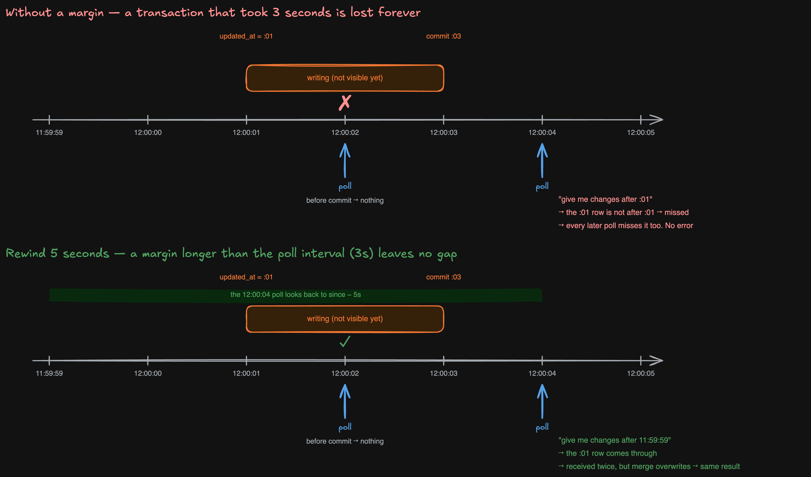
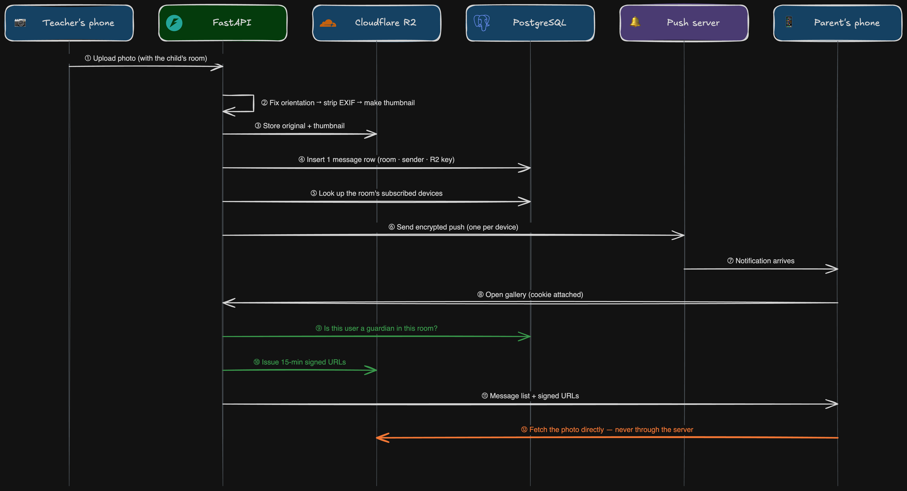

# Gallery — a child's drawing goes only to that child's guardians

> This is the most-used feature today. Uploading and viewing photos is the same everywhere, so that
> part is short. **The decisions specific to this project** get the space.

---

## 1. What it does

After class, the teacher photographs each child's drawing and **sends it to that child's guardians.**
Parents get a push on their phone, open it, and leave an emoji. It is a chat, so conversations happen
too. This used to be done in 1:1 messenger chats, and **this replaced that messenger.** Moving everyone
at once could have caused pushback, so it was done gradually, watching how parents reacted after launch.

```
Room      one parent = one room. The teacher sees every room. The room is created in the same
          transaction as the sign-up approval
Photo     uploaded by the teacher, tagged with which child drew it (siblings can share a room)
Album     per-child view · full-size view · infinite scroll back to old drawings
Reactions emoji · read receipts
Alerts    new photo → web push to the room's guardians
Delete    teacher only. It is a "deleted" mark, so it can be undone, and it disappears on the other side too
```

Three things differ from a messenger: **the data stays with the school** (a messenger's history cannot
be moved) · **who opened what, and when, is recorded** (audit log) · **only school people are here**
(no ads, no other chats, no other schools — possible because one school uses it).

---

## 2. Sync — where the most thinking went

**Decision ① — polling.** The gallery asks the server *"anything new?"* **every 3 seconds**
(`POLL_MS = 3000`). Server push (WebSocket · SSE) was not chosen because a room has two people:
the value of real-time is small next to the cost of **connection management, reconnects, and the server
holding connection state.** The switch happens on **numbers collected from polling** (empty-poll ratio ·
request count — see ⑦), not on a feeling. Streaming the AI agent's answers token by token is the
likely trigger.

**Decision ② — two endpoints, two kinds of cursor.**

```
GET /rooms/{id}/messages   a stream that needs order    →  (sent_at, id) tuple cursor.  list · infinite scroll
GET /rooms/{id}/changes    a set where order is noise   →  timestamp (updated_at) cursor.  "give me what changed"
```

The tuple cursor **cannot** be reused for `changes`. If an emoji lands on the anchor message, that row's
`updated_at` moves — **the cursor moves by itself.** `sent_at` never changes, so it can anchor.
`updated_at` cannot.

"Give me what changed" hides five more decisions (③–⑦).



**③ The server issues the cursor.** `updated_at` is stamped by a DB trigger using `now()`, so the value
we compare against must also come from the DB. If the browser made the cursor from its own clock, a
phone running ahead of the server would miss every change in that window **forever, with no error.**
And the server takes the timestamp **before** the query: `now()` is the transaction start time, so the
cursor means "when the query began", and anything committed during the query stays behind the cursor
and is picked up next poll.

**④ The margin must be longer than the poll interval.** `updated_at` is the transaction *start* time.
If a write starts at 12:00:01 and commits at 12:00:03, the 12:00:02 poll cannot see it, and the
12:00:04 poll asks for "after :01" — the row **falls through forever.** The DB does not store "when this
became visible" anywhere. So we rewind: `since - SAFE_MARGIN` (5 seconds). The failure condition is
*"a transaction spans one poll"*, so the margin must exceed the interval (3 seconds).
**Raise the interval, raise the margin. They are not independent.**

**⑤ The price is duplicates, so the merge overwrites.** The same change arrives more than once.
The frontend merge is an assignment (=), so it is idempotent. The moment someone changes it to an
accumulation (+=), this safety net breaks. The cost is close to zero: the index jumps to the start of the
range, so rows scanned equal **actual changes**, not the width of the time window.

**⑥ Deleted rows are sent too.** With a `deleted_at IS NULL` filter, deleted rows vanish from the
response and the frontend cannot tell "nothing arrived" from "it was deleted". So deleted rows ride
along as `{"deleted": true}` tombstones. This collides with another rule, *"the delete filter lives in
one entry point"*. We **knew** it collided and split the endpoint in two (list and pagination still filter).

**⑦ Five seconds is an unmeasured guess, so measurement was built in.** Every poll logs four numbers:

```
margin_hits     changes caught only because of the margin. Stays at 0 → shrink it. Fires often → the margin is doing real work
empty           was this poll empty? This ratio is "how much polling is wasted". Evidence for revisiting ①
cursor_age_ms   how old the client's cursor is. Grows when polling falls behind
sample_rate     how many polls this one line stands for
```

Empty polls are **sampled at 1 in 10** (`EMPTY_POLL_SAMPLE_RATE = 10`). Otherwise 10 users produce
12,000 lines an hour, and during an incident one ERROR has to be found inside that. Performance is
statistics, so a sample is enough. Polls that **had** changes are always logged — that is the real signal.
Dropped lines are not thrown away; they go to DEBUG. Once we switch to server push these statistics
can never be collected, so they were planted now.

---

## 3. Photos never pass through the server



```
 1  teacher → server        upload (with which child's room)
 2  server                  fix orientation → strip EXIF → make thumbnail
 3  server → R2             store original + thumbnail
 4  server → DB             one message row (room · sender · R2 key)
 5  server → DB             the room's subscribed devices
 6  server → push server    encrypted notification (one per device)
 7  push server → parent    notification arrives
 8  parent → server         open gallery (cookie attached)
 9  server → DB             is this user a guardian in this room?
10  server → R2             issue a 15-minute signed URL
11  server → parent         message list + signed URLs
12  parent → R2             fetch the photo directly
```

**Decision ⑧ — the server decides; it does not carry bytes.** The browser fetches photos from R2 directly.

```
❌ browser → server → R2 → server → browser     the server carries all photo traffic. Slow, expensive, memory-hungry
✅ browser → server (permission + signed URL)    browser → R2 (the photo itself)
```

The bucket is private, so knowing a path is useless without a signed URL, and signed URLs expire in
**15 minutes.** A permanent URL leaked once is valid forever. With expiry, a leak has a short life.

**Decision ⑨ — strip EXIF, but fix orientation first.** EXIF is metadata the camera writes into the file:
capture time, device model, **GPS location**, and the rotation hint *"display this turned 90°"*. Photos
taken at the school would otherwise carry location coordinates to parents' devices, and that cannot be
undone, so EXIF is removed at upload. 🔴 **Order matters.** A portrait photo from a phone usually has
its pixels stored landscape with a rotation hint in EXIF. Strip EXIF first and the hint is gone —
**the photo lies on its side.** We apply the rotation to the pixels **first**, then strip.

(Keeping both original and thumbnail is standard, so one line: storage is cheap, and **losing the original
is the irreversible side.**)

---

## 4. Permissions — one function decides

```
Gallery access   status == "active" and role in ("director", "parent")   allow-list. Otherwise 403
Room access      teacher → every room / parent → own room only.  One function decides, not each endpoint
Identity         not in the URL. The cookie decides
Audit            opening a room writes one audit row — who · when · which room
```

**Decision ⑩ — an allow-list, not a deny-list.** Roles today are teacher, parent, visitor. When the
community opens, a new role like **student** arrives. This check does not need to change: the new role
is **automatically shut out of the gallery** because it is not on the list. A deny-list (`not in`) would
have let it through by default.
→ Login and approval in full: [auth.md](./auth.md)
